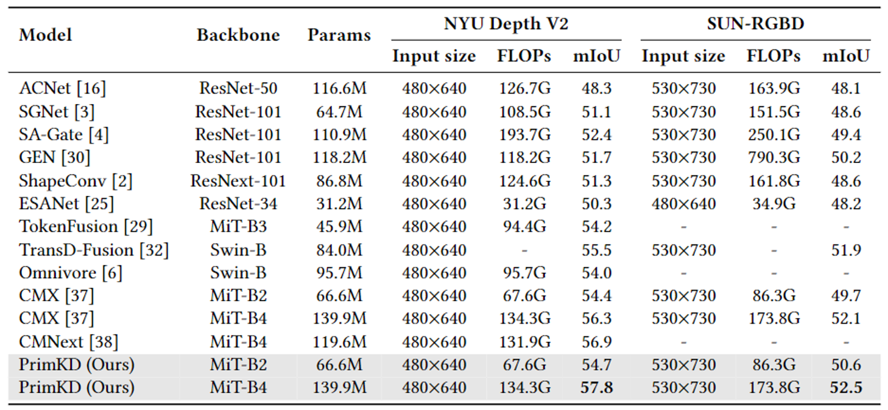

# PrimKD: Primary Modality Guided Multimodal Fusion for RGB-D Semantic Segmentation (ACM MM 2024)

This is the official implementation of our paper  **[PrimKD: Primary Modality Guided Multimodal Fusion for RGB-D Semantic Segmentation](https://dl.acm.org/doi/pdf/10.1145/3664647.3681253))**.

Authors: Zhiwei Hao, Zhongyu Xiao, Yong Luo, Jianyuan Guo, Jing Wang, Li Shen, Han Hu


## Introduction
We present a KD-based approach to guide multimodal fusion, with a specific focus on the primary modality. Unlike existing methods that often treat modalities equally without considering their varying levels of content, our findings and proposed method offer insights into effective multimodal processing.

## Framework


## Data
### NYU Depth V2 Datasets
You could download the official NYU Depth V2 data [here](https://cs.nyu.edu/~silberman/datasets/nyu_depth_v2.html). After downloading the official data, you should modify them according to the structure of directories we provide. 

### SUN-RGBD Datasets
You can download the dataset from the official SUNRGBD [website](https://rgbd.cs.princeton.edu/) and preprocess it according to the requirements specified on the website.

For RGB-Depth semantic segmentation, the generation of HHA maps from Depth maps can refer to https://github.com/charlesCXK/Depth2HHA-python.

## Installation
1. Clone this repo.
```
$ git clone https://github.com/xiaoshideta/PrimKD.git
$ cd primkd-main
```

2. Install all dependencies.
```
$ conda create -name primkd python=3.8.11
$ pip install -r requirements.txt
$ conda activate primkd
```


## Directory Tree
Your directory tree should look like this:
```shell
|-- <config>
|-- <dataloder>
|-- <pretrained>
    |-- <pre>
    |-- <segformer>
|-- <datasets>
    |-- <NYUDepthv2>
        |-- <RGBFolder>
        |-- <HHAFolder>
        |-- <LabelFolder>
        |-- train.txt
        |-- test.txt
```

## Training and Inference
### Pretrain weights:

Download the pretrained segformer [here](https://drive.google.com/file/d/1e4wG6GlBNeSTf3FzWLmRcJrthSwnmh7G/view?usp=sharing).

Download the pretrained teacher model [here](https://drive.google.com/file/d/1sIt0GWczeMTjfYI55jFeihj8ZDpTMY0G/view?usp=sharing).

### Training
```shell
$ bash train.sh
```

```shell
$ CUDA_VISIBLE_DEVICES=0,1,2,3 python -m torch.distributed.launch --nproc_per_node=4 train.py --port=29516 --distillation_alpha=1.0 --distillation_beta=0.1 --distillation_flag=1 --lambda_mask=0.75 --select="max" --mask_single="hint"
```

### Inference
```shell
$ bash val.sh
```
```shell
CUDA_VISIBLE_DEVICES="0" python val.py -d="0" -e="your checkpoint path" --save_path="your save path"
```

## Result



## Citation
If you find this work useful for your research, please cite our paper:
```
@inproceedings{hao2024primkd,
  title={PrimKD: Primary Modality Guided Multimodal Fusion for RGB-D Semantic Segmentation},
  author={Hao, Zhiwei and Xiao, Zhongyu and Luo, Yong and Guo, Jianyuan and Wang, Jing and Shen, Li and Hu, Han},
  booktitle={ACM Multimedia 2024}
}
```

## Acknowledgement

Part of our code is based on [CMX](https://github.com/charlesCXK/RGBD_Semantic_Segmentation_PyTorch), thanks for their excellent work!

